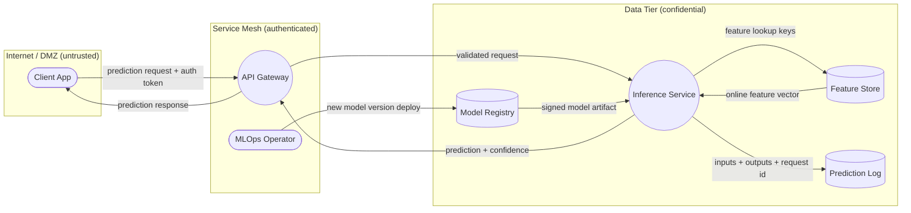

# module-2 · STRIDE threat model of an ML inference service

A **threat-modeling-as-code** project: describe a realistic ML inference service as a
data-flow model, then walk it with a deterministic STRIDE rule engine to enumerate
threats, score them, and emit an auditable report + per-category metrics. Pure stdlib
by default; [`pytm`](https://github.com/izar/pytm) is an optional enhanced path.

⚠️ **Authorized use only.** The "target" is a self-authored architecture model with
synthetic data — no real system is probed. See [../../ETHICS.md](../../ETHICS.md).

## The idea

**STRIDE** (Microsoft) maps every threat to the security property it violates:

| Letter | Threat | Property violated |
| --- | --- | --- |
| **S** | Spoofing | Authentication |
| **T** | Tampering | Integrity |
| **R** | Repudiation | Non-repudiation |
| **I** | Information Disclosure | Confidentiality |
| **D** | Denial of Service | Availability |
| **E** | Elevation of Privilege | Authorization |

You enumerate threats by walking a **data-flow diagram (DFD)** and asking the six
questions at every element and every flow that crosses a **trust boundary**. This
project does that in two layers:

1. A **per-flow rule engine** ([`threats.py`](src/stride_ml/threats.py)) derives generic
   STRIDE threats from each flow's attributes (crosses a boundary? authenticated?
   encrypted? carries PII?).
2. A **curated ML-specific set** that classic STRIDE under-covers — model/supply-chain
   poisoning, adversarial-example evasion, model extraction, membership inference,
   sponge inputs, unsafe pickle deserialization (RCE) — each mapped onto a STRIDE letter
   so the counts stay coherent.

### The data-flow diagram



`([rounded])` = external actor · `((round))` = process · `[(cylinder)]` = datastore.
The generated [docs/threat-model.md](docs/threat-model.md) re-emits this diagram with
🔒 markers on encrypted flows.

## Run it

```bash
# from this folder; uses uv if installed, else system python3
make detect          # walk the DFD, write docs/threat-model.md + figure + metrics.json
make test            # fast smoke tests
make pytm            # use pytm if installed (falls back to the stdlib path)
```

The **default `make detect` path is stdlib-only and fully offline** (matplotlib is used
only for the bar chart; the markdown + metrics are written even without it).

Outputs:
- [docs/threat-model.md](docs/threat-model.md) — full report: Mermaid DFD, trust
  boundaries, STRIDE summary table, and every threat with severity + mitigation.
- [results/figures/stride_counts.png](results/figures/stride_counts.png) — threats per
  STRIDE category.
- [results/metrics.json](results/metrics.json) — counts per category + per severity
  (committed as evidence; dashboard-discoverable shape).

## What the result shows

The model surfaces **18 threats** across all six STRIDE categories. The heaviest bucket
is **Information Disclosure** — exactly what you'd expect for an ML service: every PII
flow plus model-extraction and membership-inference leaks land here. The highest-severity
findings are **ML supply-chain poisoning** (a tampered registry artifact) and **unsafe
pickle deserialization → RCE** when loading a model, both classic ML-ops footguns that a
naive "it's just a web API" threat model would miss.

## Interview story (3 sentences)

> I modeled an ML inference service as a data-flow diagram and ran a deterministic STRIDE
> rule engine over it, producing an auditable threat report with per-category counts and
> concrete mitigations. The point was to show that ML systems need both classic STRIDE
> *and* ML-native threats — model poisoning, adversarial evasion, extraction, membership
> inference, pickle-RCE — which I mapped onto the STRIDE letters so they slot into normal
> security review. It's threat-modeling-as-code: stdlib by default, optionally backed by
> pytm, with tests asserting invariants like "every STRIDE category is exercised."

## Layout

```
src/stride_ml/   utils.py (seeds) · model.py (DFD dataclasses + STRIDE) ·
                 threats.py (rule engine) · report.py (Mermaid + Markdown + optional pytm)
scripts/         threatmodel.py  (writes docs/threat-model.md + figure + metrics.json)
tests/           test_smoke.py   (fast invariants + one @slow end-to-end)
docs/            threat-model.md  (generated, committed)
results/         figures/*.png + metrics.json  (committed)
data/ models/    git-ignored; not used (this is a threat model, not a training pipeline)
```

## References

- Microsoft. *The STRIDE Threat Model* / *Threat Modeling: Designing for Security*
  (Shostack, 2014).
- OWASP. *Threat Modeling Process* and *Machine Learning Security Top 10*.
- MITRE **ATLAS** — Adversarial Threat Landscape for AI Systems.
- NIST **AI 100-2** — Adversarial Machine Learning taxonomy.
- `pytm` — Pythonic threat-modeling framework, https://github.com/izar/pytm.
